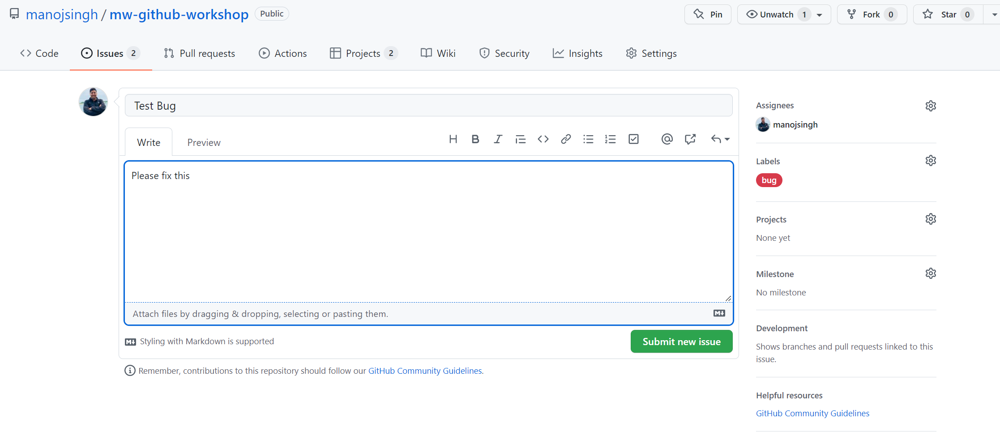
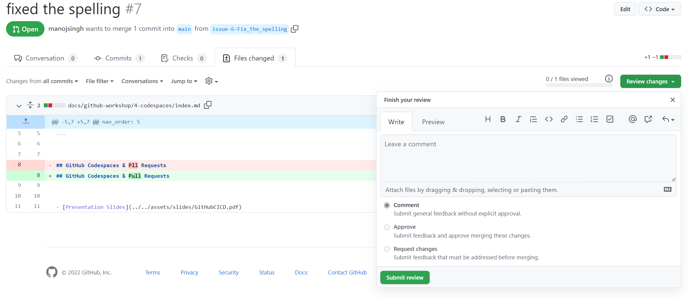

## GitHub Codespaces & Pull Requests 

### Creating and handling Pull Requests 

- Create an issue from the issue page and assign the tag "bug" to it



This will create a bug fix branch for you. 

- Fix the bug in that branch and push it in. 
- Then create a pull request for that branch
- Click on the Pull Requests tab
- Then review and merge the changes




### Codespaces

### Steps to enable codespaces for local environments
- Create a folder named ".devcontainer" under the docs
- Add a file named `devcontainer.json` with the following content
```
{
    "name": "Codespaces Apim github pages",
    "extensions": [
		"vscode-icons-team.vscode-icons",
        "ms-azuretools.vscode-docker",
        "ginfuru.ginfuru-vscode-jekyll-syntax"
    ],
    "dockerFile": "Dockerfile",
    "settings": {
        "terminal.integrated.shell.linux": "/usr/bin/zsh",
    }
}
```
- Add a file named **`Dockerfile`** with the following content
```
    FROM ubuntu:20.04

    WORKDIR /home/

    COPY . .

    ENV DEBIAN_FRONTEND=noninteractive 
    RUN bash ./setup.sh

    RUN echo 'export NVM_DIR="$HOME/.nvm"' >> "$HOME/.zshrc"
    RUN echo '\n' >> "$HOME/.zshrc"
```
- Add a shell script named `setup.sh` with the following content
```
    update and install some things we should probably have
    apt-get update
    apt-get install -y \
    curl \
    git \
    gnupg2 \
    jq \
    sudo \
    zsh \
    icu-devtools

    # setup and install oh-my-zsh
    sh -c "$(curl -fsSL https://raw.githubusercontent.com/robbyrussell/oh-my-zsh/master/tools/install.sh)"
    cp -R /root/.oh-my-zsh /home/$USERNAME
    cp /root/.zshrc /home/$USERNAME
    sed -i -e "s/\/root\/.oh-my-zsh/\/home\/$USERNAME\/.oh-my-zsh/g" /home/$USERNAME/.zshrc
    chown -R $USER_UID:$USER_GID /home/$USERNAME/.oh-my-zsh /home/$USERNAME/.zshrc

    # setup and install ruby, jekyll and bundler
    apt-get install -y ruby-full build-essential zlib1g-dev
    gem install jekyll bundler
```


- [Presentation Slides](../../assets/slides/GitHubCICD.pdf) 
