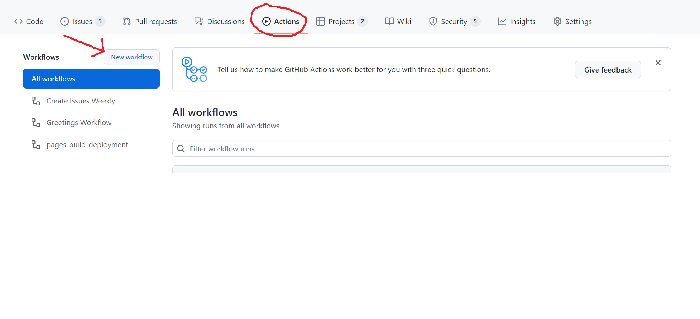
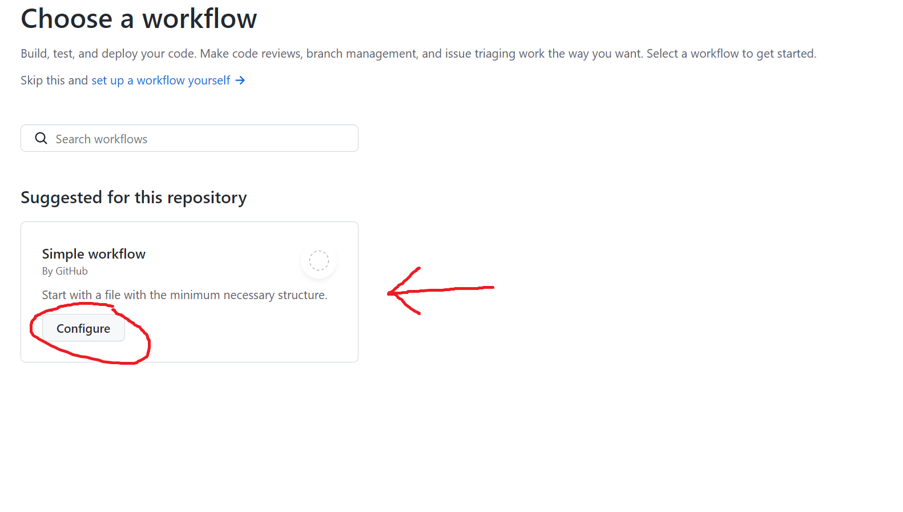
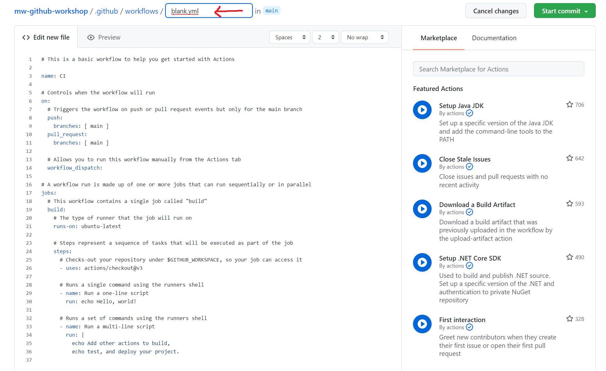
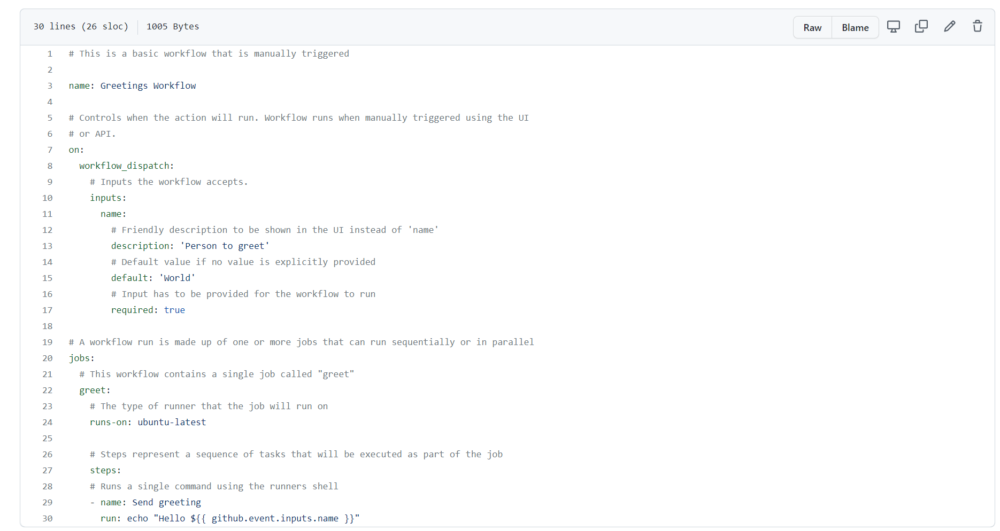
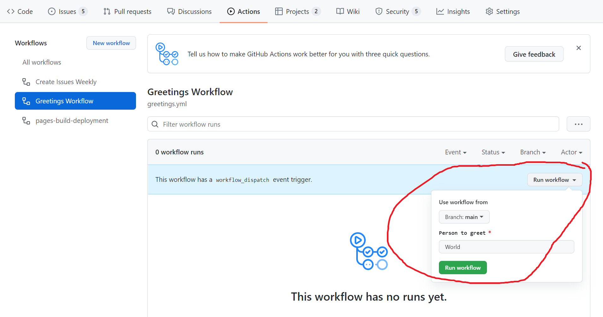
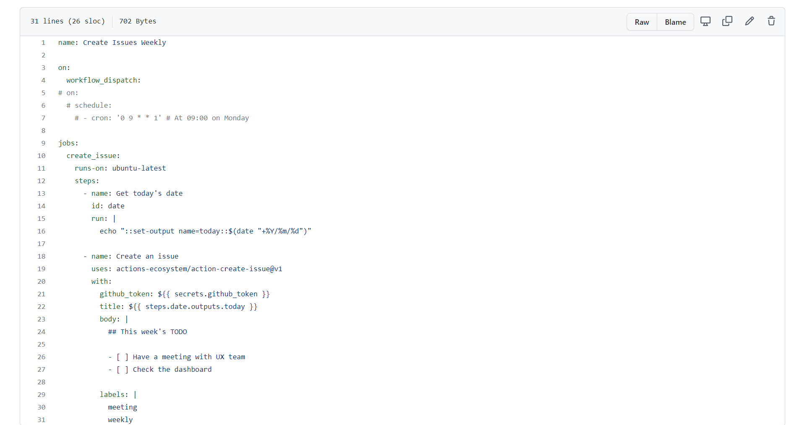

## GitHub Actions, Events, Workflows

- [Presentation Slides](../../assets/slides/GitHubCodespaces.pdf) 

- Create Workflow

- Choose Simple Workflow

- Update the Workflow

- Update the name of the yaml file and add this code

- Run the Workflow

### Workflow to create Issues

